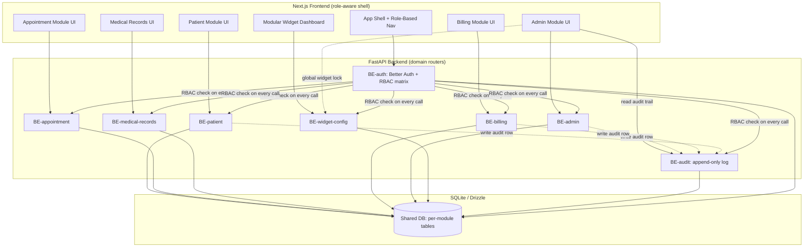

# Hospital Management System — Phase 1 PRD

## Overview

The Hospital Management System is a modular web platform built to run the full clinical and administrative loop of a healthcare provider — from a single-doctor clinic with a handful of patients to a multi-department enterprise hospital with dozens of doctors and thousands of records — without requiring a different product at each stage of growth. The system unifies four chronically painful workflows into one coherent application: it gives every clinician a single, cross-department view of a patient's history instead of scattered per-department charts; it collapses registration into a single guarded intake flow that catches duplicate patients before they're created; it replaces ad-hoc doctor scheduling with conflict-aware booking so double-bookings and no-shift gaps stop happening; and it turns billing and insurance claims into a tracked, auditable workflow instead of a source of silent revenue leakage. The hero of the product is its modularity: every module (Patient, Appointment, Medical Records, Billing, Admin) is independently ownable by a backend domain team, every screen respects a strict role × module permission matrix (Admin, Doctor, Nurse, Receptionist), and every user — regardless of role — gets a personal, drag-and-drop configurable dashboard built from a shared widget library that the hospital admin can globally lock down. This is what lets the same codebase serve a five-patient clinic today and a multi-department hospital tomorrow: capability is additive, not rearchitected.

## Requirements

### Patient Module
- Receptionist-facing patient registration form capturing demographics, contact info, national ID, and emergency contact
- Duplicate-detection check at registration time using national ID exact match and name + date-of-birth fuzzy match, surfaced before a new record is committed
- Patient search across the full patient directory by name, national ID, phone, or MRN (medical record number)
- Patient list view with filters (department, registration date range, doctor)
- Patient detail view showing a single cross-department profile: demographics, active department tags, and a unified activity timeline
- Patient timeline aggregates visits, prescriptions, and billing events across every department the patient has touched — no per-department silos
- Recorded allergies surfaced as a persistent safety banner on every screen showing the patient, and checked against any prescription before it can be signed
- Triage acuity (critical / urgent / standard / routine) and admission status (admitted / outpatient / discharged) as first-class patient attributes, used to sort queues and worklists

### Appointment Module
- Appointment booking form (patient, doctor, department, date/time, reason for visit)
- Doctor daily calendar view showing all booked slots for a selected doctor and date
- Conflict detection that blocks a booking when the same doctor is already booked in an overlapping slot
- Availability rules per doctor (working hours, department assignment, blocked-out days)
- Receptionist queue view of today's upcoming appointments
- Appointment lifecycle transitions (check-in, start, complete, cancel, mark no-show) with check-in timestamp so patient wait time is measurable rather than estimated

### Medical Records Module
- Visit note entry (chief complaint, diagnosis, clinical notes) tied to an appointment and a doctor
- Prescription entry (medication, dosage, frequency, duration) tied to a visit note
- Attachment upload (lab results, imaging references) attached to a visit note
- Cross-department patient history endpoint aggregating all visit notes, prescriptions, and attachments for a patient regardless of which department created them
- Patient timeline UI rendering the aggregated history in chronological order with department source labels
- Vitals capture (blood pressure, heart rate, SpO₂, temperature, respiratory rate) recorded by nursing intake against a patient and optionally an appointment, with plausibility-range validation and a trend view over time
- Care plan items (task, due time, priority, completion) attached to a patient so a nurse's shift work is tracked rather than remembered

### Billing Module
- Invoice creation from a completed visit, with line items (consultation, procedures, medication)
- Payment recording against an invoice (partial or full, method, date)
- Insurance claim stub — claim submission record linked to an invoice with payer, claim number, and status
- Invoice payment workflow (draft, unpaid, partially paid, paid, void) to eliminate silent billing errors
- Insurance claim workflow tracked separately from the invoice (none, draft, submitted, in review, approved, denied, settled), with denial reason and appeal deadline captured so denials can be worked rather than absorbed
- Billing invoice list and detail views with status filters

### Admin Module
- User management: CRUD on staff accounts, role assignment, department assignment
- Department management: CRUD on departments (name, type, active doctors)
- Role × module permission matrix: every role (Admin, Doctor, Nurse, Receptionist) has an explicit allow/deny per module, enforced server-side
- Widget library governance: admin can globally enable/disable widget types and lock specific widgets so end users cannot remove them from their dashboard
- Department bed capacity and live occupancy, so ward pressure is visible before it becomes a crisis
- Nurse-to-patient shift assignment, backing each nurse's "my patients this shift" worklist
- Immutable audit log of privileged and clinically consequential actions (role change, permission-matrix edit, duplicate-detection override, invoice void, widget-governance publish), queryable by Admin

### Cross-cutting (Auth, RBAC, Dashboard Widgets)
- Authentication via Better Auth (email/password login, session management, logout) backed by SQLite/Drizzle
- Role-based access control enforced at the API layer — every endpoint checks the caller's role against the permission matrix before executing
- Modular dashboard widget grid: every user (any role) gets a default widget set on first login, based on their role, and can drag/drop, resize, enable, or disable widgets on their own dashboard
- Per-user widget layout is persisted server-side so it survives across sessions and devices
- Admin-level global widget lock overrides per-user configuration for locked widgets (they cannot be removed or disabled by the end user)
- Staff accounts are provisioned by an Admin only. There is no public self-service sign-up; account recovery (forgot password) remains available to existing accounts

## Design Reference

`promax-prototype/` is the **visual and behavioural source of truth** for Phase 1. Where this PRD describes *what* a screen must do, the prototype defines *how it looks and behaves*, down to states, copy, and interaction detail. Build against it, not against a fresh interpretation of the prose above.

- **`promax-prototype/DESIGN_SYSTEM.md`** — tokens, type scale, density modes, motion tier, component contract, and the twelve-item accessibility floor every screen must clear.
- **`promax-prototype/prototype/index.html`** — the viewer. Press `c` to compare any page against the earlier `ux-prototype/` build.
- **`promax-prototype/components/`** — the TypeScript expression of the component contract (`Button`, `Field`, `DataTable`, `Dialog`, `Toast`, `StateRegion`, `PermissionMatrix`, `WidgetGrid`, …).

| Screen | Prototype file |
|---|---|
| Sign in | `prototype/01-signin.html` |
| Admin dashboard | `prototype/02-admin-dashboard.html` |
| Patient directory | `prototype/03-patient-list.html` |
| Patient record | `prototype/04-patient-detail.html` |
| Appointment booking | `prototype/05-appointment-booking.html` |
| Doctor schedule | `prototype/06-doctor-schedule.html` |
| Visit note | `prototype/07-record-entry.html` |
| Billing & claims | `prototype/08-billing.html` |
| Admin · Users | `prototype/09-admin-users.html` |
| Admin · Departments | `prototype/10-admin-departments.html` |
| Admin · Widget library | `prototype/11-admin-widget-library.html` |
| Admin · Permissions | `prototype/12-admin-permissions.html` |
| Receptionist dashboard | `prototype/13-receptionist-dashboard.html` |
| Doctor dashboard | `prototype/14-doctor-dashboard.html` |
| Nurse dashboard | `prototype/15-nurse-dashboard.html` |

Two deliberate deltas where the build must exceed the prototype:

1. **Widget resize.** The prototype implements reorder and remove only. `user_widget_layout.size` exists and resize is required — it must be added during implementation.
2. **Saved list views.** The patient directory shows a "Save this view" affordance. Persisting saved views is **Phase 2**; the control ships disabled or is omitted in Phase 1.

## Architecture

The system is a modular monolith at the API layer and a modular app-router structure on the frontend, split cleanly along the same module boundaries as the backend domains so a team can own Patient, Appointment, Medical Records, Billing, or Admin end-to-end without touching another module's tables. Next.js serves all authenticated pages behind a role-aware shell that reads the current user's permission matrix on login and renders navigation accordingly; FastAPI exposes one router per domain (auth, patient, appointment, medical-records, billing, admin, widget-config, audit), each with its own Pydantic schemas and its own tables in the shared SQLite database via Drizzle migrations. The audit router is write-mostly: every other router calls into it on a privileged or clinically consequential mutation, and only Admin can read it back. RBAC is enforced twice: the frontend hides UI the role can't use (UX convenience), and every FastAPI route independently re-checks the caller's role against the permission matrix before touching data (the actual security boundary — the frontend check is not trusted). The widget configuration layer sits orthogonal to the clinical modules: it stores a per-user ordered list of enabled widget IDs plus a global lock list maintained by Admin, and the dashboard shell merges "role default widgets" with "user overrides" with "admin locks" (locks always win) at render time.

## DB Schema

### Auth / RBAC tables
- `users` — id, email, password_hash (Better Auth managed), full_name, role (admin/doctor/nurse/receptionist), department_id (nullable, FK departments), specialisation (nullable, doctors only), status (active/invited/inactive), mfa_enabled (bool), last_login_at (nullable), created_at
- `sessions` — id, user_id (FK users), token, expires_at, created_at (Better Auth managed)
- `permission_matrix` — id, role, module, can_view, can_create, can_edit, can_delete (seeded row per role × module combination)

### Patient tables
- `patients` — id, mrn (unique), full_name, dob, sex, national_id (unique, nullable), phone, address, emergency_contact_name, emergency_contact_phone, acuity (critical/urgent/standard/routine, default routine), status (admitted/outpatient/discharged, default outpatient), primary_department_id (nullable, FK departments), payer_name (nullable), created_by (FK users), created_at
- `patient_allergies` — id, patient_id (FK patients), substance, severity (mild/moderate/severe), noted_by (FK users), noted_at
- `patient_dedup_flags` — id, patient_id (FK patients), matched_patient_id (FK patients), match_type (national_id/fuzzy_name_dob), resolved (bool), overridden_by (nullable, FK users), created_at
- `patient_assignments` — id, patient_id (FK patients), nurse_id (FK users), bed_label (nullable), shift_date, shift_window, assigned_at

### Appointment tables
- `appointments` — id, patient_id (FK patients), doctor_id (FK users), department_id (FK departments), scheduled_at, duration_minutes, reason, status (booked/checked_in/in_progress/completed/cancelled/no_show), checked_in_at (nullable), completed_at (nullable), created_at
- `doctor_availability` — id, doctor_id (FK users), day_of_week, start_time, end_time, department_id (FK departments)
- `doctor_blocked_days` — id, doctor_id (FK users), blocked_date, start_time (nullable), end_time (nullable), reason

### Medical Records tables
- `visit_notes` — id, appointment_id (FK appointments), patient_id (FK patients), doctor_id (FK users), chief_complaint, diagnosis, clinical_notes, department_id (FK departments), status (draft/submitted/signed), signed_at (nullable), created_at
- `prescriptions` — id, visit_note_id (FK visit_notes), medication, dosage, frequency, duration_days, created_at
- `attachments` — id, visit_note_id (FK visit_notes), file_name, file_url, uploaded_by (FK users), created_at
- `vitals` — id, patient_id (FK patients), appointment_id (nullable, FK appointments), systolic, diastolic, heart_rate, spo2, temperature_c, respiratory_rate, note (nullable), recorded_by (FK users), recorded_at
- `care_plan_items` — id, patient_id (FK patients), source_visit_note_id (nullable, FK visit_notes), description, due_at, priority (high/normal/low), completed (bool), completed_by (nullable, FK users), completed_at (nullable), created_at

### Billing tables
- `invoices` — id, patient_id (FK patients), visit_note_id (FK visit_notes, nullable), payer_name (nullable), total_amount, amount_paid, status (draft/unpaid/partially_paid/paid/void), created_at
- `invoice_line_items` — id, invoice_id (FK invoices), code, description, quantity, unit_amount, item_type (consultation/procedure/medication/room), department_id (FK departments)
- `payments` — id, invoice_id (FK invoices), amount, method, reference (nullable), paid_at
- `insurance_claims` — id, invoice_id (FK invoices), payer_name, claim_number, status (none/draft/submitted/in_review/approved/denied/settled), denial_reason (nullable), appeal_deadline (nullable), submitted_at

> Status-enum note: `invoices.status` tracks *money owed* and `insurance_claims.status` tracks *the payer conversation*. They are deliberately separate — an invoice is never "denied"; a claim is.

### Admin tables
- `departments` — id, name, code (short code used on invoices and requisitions), type (general/pediatric/cardiology/emergency), bed_capacity, min_clinicians_per_shift, active, created_at
- `department_staff` — id, department_id (FK departments), user_id (FK users), assigned_at
- `audit_log` — id, actor_user_id (FK users), action (role_change/permission_matrix_edit/dedup_override/invoice_void/widget_publish/user_deactivate/…), entity_type, entity_id, before_json (nullable), after_json (nullable), reason (nullable), created_at — append-only, no update or delete path

### Widget Config tables
- `widget_definitions` — id, key, name, default_role (which role gets it by default), globally_enabled (bool), globally_locked (bool)
- `user_widget_layout` — id, user_id (FK users), widget_id (FK widget_definitions), position_order, enabled, size

## Tech Stack

- Next.js (App Router) — web frontend, role-aware routing and layout
- FastAPI — backend REST API, one router per domain module
- SQLite — primary datastore for Phase 1, single-file deployment friendly for small clinics
- Drizzle ORM — schema migrations and typed queries against SQLite
- Better Auth — authentication (session-based login/logout, email/password), integrated with the `users`/`sessions` tables
- Material Design 3 (M3) — component design language for consistent UI across modules
- Tailwind CSS — utility-first styling layer implementing the M3 tokens

## User Flow

**Receptionist flow:** A receptionist logs in and lands on a dashboard with the "Today's Registration Queue" and "Today's Appointments" widgets. A new patient walks in; the receptionist opens Patient Registration, enters demographics and national ID, and the system runs duplicate detection in real time — if a national ID or a fuzzy name+DOB match is found, the receptionist is shown the existing record and chooses to link or override before a new patient is created. Once registered, the receptionist opens Appointment Booking, selects a department and doctor, and the doctor's daily calendar shows open slots; picking an already-booked slot is blocked by conflict detection before submission. The appointment appears in the day's queue, and the receptionist can later open Billing to record the patient's payment against the visit's invoice.

**Doctor flow:** A doctor logs in and sees their role-default dashboard: "Today's Schedule," "Pending Records," and "Vitals Queue" widgets (the doctor has previously dragged "Pending Records" to the top of their layout — that customization persists across logins). From the daily schedule, the doctor opens an appointment, reviews the patient's cross-department timeline (including notes and prescriptions from other departments), and enters a new visit note with diagnosis and clinical notes. From the same screen the doctor adds a prescription and attaches a lab result file. The visit note and prescription immediately become visible in the patient's unified timeline, tagged with this department, for any other doctor who later treats the same patient.

**Nurse flow:** A nurse logs in to a dashboard showing "Assigned Patients" and "Vitals Entry" widgets. The nurse selects an assigned patient, records vitals as part of intake ahead of the doctor's visit, and reviews the patient's active care plan drawn from recent visit notes. The nurse's role permissions allow viewing and appending to medical records but not editing billing or admin data — attempts to navigate to those modules are hidden from the nav entirely, and the underlying API would reject the request if attempted directly.

**Admin flow:** An admin logs in to a dashboard with hospital-wide widgets (staff count, department load, billing summary). The admin opens User Management to onboard a new nurse, assigning them a role and a department; the permission matrix instantly governs what that nurse can see on next login. The admin opens Department Management to stand up a new department as the hospital scales, and opens Widget Library Settings to lock the "Today's Schedule" widget so no doctor can remove it from their dashboard, while leaving all other widgets user-configurable.

## Feature Specifications

## Feature: Patient Registration
Receptionist-facing intake form that creates a new patient record with duplicate protection.
## Specification
### Goal
Let front-desk staff register a new patient quickly while preventing duplicate records across departments.
### Definition of Done
- [ ] Registration form captures demographics, national ID, contact, and emergency contact
- [ ] Submitting a valid form creates a patient record with a unique MRN
- [ ] Duplicate detection runs before the record is committed

## Sub-feature: New Patient Intake Form
### Goal
Capture all demographic and contact fields needed to create a patient record in one guided form.
### Definition of Done
- [ ] Form validates required fields (name, DOB, phone) before submit
- [ ] National ID field is optional but validated for format when present
- [ ] Successful submit shows the newly assigned MRN to the receptionist

## Sub-feature: Duplicate Detection
### Goal
Catch duplicate patients at the point of registration instead of after they've fragmented a patient's history.
### Definition of Done
- [ ] Exact national ID match blocks silent creation and surfaces the existing record
- [ ] Fuzzy name + DOB match surfaces a "possible duplicate" warning with a link/override choice
- [ ] Receptionist can explicitly override and create a new record when the match is a false positive

## Feature: Patient Search & Directory
Directory-wide search and filtering across all registered patients.
## Specification
### Goal
Let any clinical or front-desk role find an existing patient in seconds regardless of which department registered them.
### Definition of Done
- [ ] Search returns results by name, national ID, phone, or MRN
- [ ] Patient list supports filtering by department and registration date range

## Sub-feature: Quick Search
### Goal
Instant, typeahead-style lookup for the common case of finding one known patient.
### Definition of Done
- [ ] Typing 3+ characters returns matching patients within the directory
- [ ] Results show name, MRN, and last visit department for disambiguation

## Sub-feature: Advanced Filters
### Goal
Let staff narrow the patient list by structured criteria instead of free text.
### Definition of Done
- [ ] Filter by department returns only patients with activity in that department
- [ ] Filter by registration date range narrows the list accordingly
- [ ] Filters are combinable (department + date range together)

## Feature: Patient Profile & Cross-Department History
Single patient profile aggregating activity from every department.
## Specification
### Goal
Replace scattered per-department charts with one canonical patient view.
### Definition of Done
- [ ] Patient detail page shows demographics, department tags, and a unified timeline
- [ ] Timeline entries are sourced from visits across all departments, not just the current one

## Sub-feature: Unified Timeline View
### Goal
Show a chronological feed of every clinical and billing touchpoint for a patient.
### Definition of Done
- [ ] Timeline merges visit notes, prescriptions, and billing events in date order
- [ ] Each entry is labeled with its originating department

## Sub-feature: Department Tagging
### Goal
Make it visible at a glance which departments a patient has been treated in.
### Definition of Done
- [ ] Patient profile header lists all departments the patient has an appointment or visit note in
- [ ] Tags update automatically as new cross-department activity occurs

## Feature: Appointment Booking
Booking flow for scheduling a patient with a doctor.
## Specification
### Goal
Let front-desk staff schedule a patient/doctor appointment without creating scheduling conflicts.
### Definition of Done
- [ ] Booking form creates an appointment tied to patient, doctor, department, and time slot
- [ ] Doctor's daily calendar reflects the new booking immediately

## Sub-feature: Booking Form
### Goal
Capture the minimum fields needed to schedule a valid appointment.
### Definition of Done
- [ ] Form requires patient, doctor, department, date/time, and reason for visit
- [ ] Submitting an invalid or incomplete form blocks booking with a clear error

## Sub-feature: Doctor Daily Calendar View
### Goal
Give staff a visual read of a doctor's booked and open slots for a given day.
### Definition of Done
- [ ] Calendar shows all booked appointments for the selected doctor and date
- [ ] Open slots are visually distinct from booked slots

## Feature: Conflict Detection & Scheduling Rules
Server-enforced rules preventing double-booking and out-of-hours scheduling.
## Specification
### Goal
Eliminate double-booking and no-shift scheduling chaos entirely at the data layer, not just the UI.
### Definition of Done
- [ ] Overlapping bookings for the same doctor are rejected server-side
- [ ] Bookings outside a doctor's configured availability are rejected

## Sub-feature: Double-Booking Prevention
### Goal
Guarantee a doctor can never be booked into two overlapping appointments.
### Definition of Done
- [ ] Booking API rejects a new appointment that overlaps an existing one for the same doctor
- [ ] Rejection returns a clear conflict error identifying the clashing appointment

## Sub-feature: Availability Rules Engine
### Goal
Constrain bookings to a doctor's actual working hours and days.
### Definition of Done
- [ ] Doctor availability (day/time windows) is configurable per doctor
- [ ] Booking outside configured hours or on a blocked-out day is rejected

## Feature: Visit Notes & Prescriptions
Clinical documentation captured during and after a patient visit.
## Specification
### Goal
Give doctors a fast way to document diagnosis, notes, and prescriptions tied to a specific visit.
### Definition of Done
- [ ] Visit note is created against an appointment with chief complaint, diagnosis, and notes
- [ ] Prescriptions can be added to a visit note with medication, dosage, frequency, duration

## Sub-feature: Visit Note Entry
### Goal
Let a doctor document a visit in one screen without leaving the appointment context.
### Definition of Done
- [ ] Visit note form is pre-linked to the current appointment and patient
- [ ] Saved visit note appears immediately in the patient's timeline

## Sub-feature: Prescription Management
### Goal
Attach structured prescription records to a visit for pharmacy and history purposes.
### Definition of Done
- [ ] Prescription form requires medication, dosage, frequency, and duration
- [ ] Multiple prescriptions can be attached to a single visit note

## Feature: Patient Timeline (Cross-Department)
Aggregated clinical history view spanning all departments.
## Specification
### Goal
Solve the "scattered medical records" pain point with one authoritative history endpoint and view.
### Definition of Done
- [ ] History endpoint aggregates visit notes, prescriptions, and attachments across all departments for a patient
- [ ] Timeline UI renders the aggregate in chronological order with department labels

## Sub-feature: Aggregated History Endpoint
### Goal
Provide a single API that returns a patient's full clinical history regardless of department.
### Definition of Done
- [ ] Endpoint returns visit notes, prescriptions, and attachments joined by patient_id
- [ ] Results are sorted chronologically and paginated for patients with long histories

## Sub-feature: Attachment Handling
### Goal
Let doctors attach supporting files (labs, imaging) to a visit note.
### Definition of Done
- [ ] Visit note supports one or more file attachments
- [ ] Attachments are retrievable from the patient timeline, not just the originating visit

## Feature: Invoice Management
Invoice creation and payment tracking for completed visits.
## Specification
### Goal
Turn billing into a tracked, auditable workflow instead of an ad-hoc process prone to errors.
### Definition of Done
- [ ] Invoice can be created from a completed visit with line items
- [ ] Payments can be recorded against an invoice, partial or full

## Sub-feature: Invoice Creation & Line Items
### Goal
Generate a structured invoice with itemized charges tied to a visit.
### Definition of Done
- [ ] Invoice supports multiple line items (consultation, procedure, medication)
- [ ] Invoice total is computed automatically from line items

## Sub-feature: Payment Recording
### Goal
Track money actually collected against an invoice over time.
### Definition of Done
- [ ] Payment entry records amount, method, and date against an invoice
- [ ] Invoice status updates automatically based on cumulative payments (partially_paid/paid)

## Feature: Insurance Claims
Claim submission and status tracking against invoices.
## Specification
### Goal
Reduce insurance claim errors that erode margin by tracking claim status explicitly instead of informally.
### Definition of Done
- [ ] Claim can be submitted against an invoice with payer and claim number
- [ ] Claim status is tracked through its lifecycle (draft/submitted/approved/denied)

## Sub-feature: Claim Submission Stub
### Goal
Capture the minimum data needed to represent a submitted insurance claim.
### Definition of Done
- [ ] Claim form requires payer name and links to an invoice
- [ ] Submitted claim is visible from the invoice detail view

## Sub-feature: Claim Status Tracking
### Goal
Make claim outcome visible so billing staff can follow up on denials.
### Definition of Done
- [ ] Claim status can be updated (submitted, approved, denied)
- [ ] Denied claims are visually flagged on the billing list view

## Feature: User & Role Management
Admin CRUD over staff accounts and role assignment.
## Specification
### Goal
Let the hospital admin manage who has access to the system and what they can do.
### Definition of Done
- [ ] Admin can create, edit, deactivate staff accounts
- [ ] Admin can assign a role and department to each user

## Sub-feature: User CRUD
### Goal
Full lifecycle management of staff accounts.
### Definition of Done
- [ ] Admin can create a user with name, email, role, and department
- [ ] Admin can edit or deactivate an existing user

## Sub-feature: Role Assignment & Permission Matrix
### Goal
Bind each user to a role that deterministically governs their module access.
### Definition of Done
- [ ] Assigning a role to a user immediately governs their nav and API access
- [ ] Permission matrix (role × module) is viewable and editable by admin

## Feature: Department Management
Admin CRUD over hospital departments.
## Specification
### Goal
Let the hospital admin model its actual department structure as it scales.
### Definition of Done
- [ ] Admin can create, edit, and deactivate departments
- [ ] Department list reflects active doctor assignments

## Sub-feature: Department CRUD
### Goal
Manage the set of departments the hospital operates.
### Definition of Done
- [ ] Admin can create a department with name and type
- [ ] Admin can edit or deactivate a department

## Sub-feature: Department-Staff Mapping
### Goal
Track which staff are assigned to which department.
### Definition of Done
- [ ] Admin can assign a user to one or more departments
- [ ] Department detail view lists its assigned staff

## Feature: Widget Library Governance
Admin-level control over which dashboard widgets exist and which are locked.
## Specification
### Goal
Give the hospital admin global control over the widget library so critical widgets can't be disabled by end users.
### Definition of Done
- [ ] Admin can globally enable/disable a widget type across the hospital
- [ ] Admin can lock a widget so individual users cannot remove or disable it

## Sub-feature: Global Widget Enable/Disable
### Goal
Control which widgets exist as options at all, hospital-wide.
### Definition of Done
- [ ] Disabling a widget globally removes it from every user's available widget list
- [ ] Re-enabling restores it as an option without deleting prior user layouts

## Sub-feature: Widget Locking
### Goal
Force-pin specific widgets onto user dashboards regardless of personal preference.
### Definition of Done
- [ ] Locked widget cannot be removed or disabled from a user's own dashboard settings
- [ ] Locked state is visibly indicated to the end user

## Feature: Authentication & RBAC
Login, session management, and server-side permission enforcement.
## Specification
### Goal
Secure the system with role-based access that's enforced at the API layer, not just hidden in the UI.
### Definition of Done
- [ ] Users can log in, stay authenticated via session, and log out
- [ ] Every API endpoint enforces the permission matrix for the caller's role

## Sub-feature: Better Auth Login/Session
### Goal
Provide secure email/password authentication with session persistence.
### Definition of Done
- [ ] Login issues a valid session on correct credentials
- [ ] Invalid credentials are rejected with a generic error (no user enumeration)
- [ ] Session expires and requires re-authentication after configured TTL

## Sub-feature: Permission Matrix Enforcement
### Goal
Make role-based restrictions a real security boundary, not a UI convenience.
### Definition of Done
- [ ] Every module API checks the caller's role against the permission matrix before executing
- [ ] Unauthorized requests are rejected with 403, regardless of frontend state

## Feature: Modular Dashboard Widgets
Configurable widget grid dashboard for every role.
## Specification
### Goal
Give every user a dashboard tailored to their role by default, and fully configurable by them afterward.
### Definition of Done
- [ ] Each role gets a sensible default widget set on first login
- [ ] Users can drag/drop, resize, enable, and disable widgets on their own dashboard

## Sub-feature: Role-Based Default Layout
### Goal
Ensure every user starts with a dashboard relevant to their job on day one.
### Definition of Done
- [ ] Doctor default includes Today's Schedule, Pending Records, Vitals Queue
- [ ] Receptionist default includes Today's Appointments, Registration Queue
- [ ] Nurse and Admin each have their own sensible default set

## Sub-feature: Per-User Drag & Drop Persistence
### Goal
Let each user's dashboard customization survive across sessions and devices.
### Definition of Done
- [ ] Widget reorder/resize/enable/disable actions persist to the backend
- [ ] Reloading the dashboard on any device reflects the saved layout
- [ ] Admin-locked widgets remain fixed even after a user's layout is saved

## Feature: Vitals Capture & Trends
Nursing intake observations recorded against a patient and reviewable by the treating doctor.
## Specification
### Goal
Make the nurse's intake observations a first-class, persisted clinical record rather than a number read aloud to the doctor.
### Definition of Done
- [ ] Vitals can be recorded against a patient, optionally linked to the appointment they were taken for
- [ ] Recorded vitals appear on the patient timeline and in the doctor's review queue

## Sub-feature: Vitals Entry
### Goal
Let a nurse capture a full observation set in one screen without leaving their worklist.
### Definition of Done
- [ ] Form captures systolic, diastolic, heart rate, SpO₂, temperature, and respiratory rate
- [ ] Each value is validated against a plausible physiological range and rejected with the range stated when outside it
- [ ] Saving records the observing user and timestamp

## Sub-feature: Vitals Review Queue & Trend
### Goal
Surface freshly recorded vitals to the doctor, and show change over time rather than a single reading.
### Definition of Done
- [ ] Doctor's queue lists patients with vitals recorded and not yet reviewed, most recent first
- [ ] Out-of-range readings are flagged with an icon and a label, not colour alone
- [ ] Patient record renders a trend of prior readings with a normal-range reference band

## Feature: Care Plan Tracking
Discrete, due-dated care tasks attached to a patient for the current shift.
## Specification
### Goal
Turn "what the nurse remembers to do this shift" into tracked, handover-able state.
### Definition of Done
- [ ] Care plan items can be created against a patient with a description, due time, and priority
- [ ] Completing an item records who completed it and when

## Sub-feature: Care Plan Item Lifecycle
### Goal
Track each task from creation to completion within a shift.
### Definition of Done
- [ ] An item can be marked complete and reopened
- [ ] Completed items are retained, not deleted, so a shift's work is auditable

## Sub-feature: Shift Handover Summary
### Goal
Give the incoming nurse an accurate picture of what was and was not done.
### Definition of Done
- [ ] Handover view lists each assigned patient with vitals status and outstanding care plan items
- [ ] Handover note is attached to the patient timeline for every patient in the assignment

## Feature: Appointment Lifecycle & Queue Management
Status transitions from booking through to completion, with measurable wait time.
## Specification
### Goal
Replace "the appointment exists" with "we know exactly where this patient is in their visit."
### Definition of Done
- [ ] An appointment can transition booked → checked_in → in_progress → completed
- [ ] An appointment can be cancelled, or marked no-show, from any pre-completion state

## Sub-feature: Check-in & Wait Time
### Goal
Timestamp arrival so wait time is measured rather than estimated.
### Definition of Done
- [ ] Check-in records `checked_in_at` and moves the appointment into the clinician's waiting list
- [ ] Wait time is derived from `checked_in_at` and surfaced on the receptionist and clinician queues

## Sub-feature: No-show Handling
### Goal
Distinguish a patient who did not attend from one who cancelled, and free the slot.
### Definition of Done
- [ ] Marking no-show frees the slot for rebooking and is distinguishable from a cancellation in reporting
- [ ] A patient's repeat no-show count is visible at the point of booking

## Feature: Patient Safety Attributes
Allergies, triage acuity, and admission status as structured patient data.
## Specification
### Goal
Prevent the two failure modes a paper chart allows: prescribing against a known allergy, and losing a deteriorating patient in a queue sorted by arrival time.
### Definition of Done
- [ ] Recorded allergies are visible on every screen that shows the patient
- [ ] Acuity and admission status are structured, sortable fields

## Sub-feature: Allergy Register & Contraindication Check
### Goal
Make a recorded allergy impossible to miss and impossible to prescribe against by accident.
### Definition of Done
- [ ] Allergies render as a persistent banner on the patient header, not behind a tab
- [ ] Signing a visit note whose prescriptions contraindicate a recorded allergy is blocked, with the clash named

## Sub-feature: Acuity & Admission Status
### Goal
Let every queue and worklist sort by clinical urgency instead of arrival order.
### Definition of Done
- [ ] Acuity is an ordered four-step scale, rendered with a distinct icon per step as well as a colour
- [ ] Patient lists and queues can be sorted and filtered by acuity and by admission status

## Feature: Department Capacity & Bed Occupancy
Bed capacity per department with live occupancy.
## Specification
### Goal
Make ward pressure visible before it becomes a diversion decision.
### Definition of Done
- [ ] Each department carries a bed capacity and a derived live occupancy count
- [ ] Occupancy at or above capacity is surfaced as an alert on the admin dashboard

## Sub-feature: Capacity Configuration
### Goal
Let the admin model each department's real bed count and staffing floor.
### Definition of Done
- [ ] Admin can set bed capacity and a minimum-clinicians-per-shift value per department
- [ ] Bed capacity cannot be set below the department's current occupied count

## Sub-feature: Occupancy Reporting
### Goal
Show utilisation per department at a glance.
### Definition of Done
- [ ] Department list shows occupied/total beds and percentage utilisation
- [ ] A department at 100% occupancy is flagged distinctly from one merely near capacity

## Feature: Nurse Shift Assignment
Mapping nurses to the patients they are responsible for during a shift.
## Specification
### Goal
Give each nurse an accurate "my patients this shift" worklist, and make responsibility explicit.
### Definition of Done
- [ ] A patient can be assigned to a nurse for a given shift, with an optional bed label
- [ ] A nurse's dashboard lists exactly their assigned patients for the current shift

## Sub-feature: Assignment Management
### Goal
Let ward coordination assign and reassign patients across a shift.
### Definition of Done
- [ ] Assignments can be created, reassigned, and ended
- [ ] A patient with no assignment appears in an explicit unassigned list rather than silently disappearing

## Feature: Audit Log
Append-only record of privileged and clinically consequential actions.
## Specification
### Goal
Make it possible to answer "who changed this, when, and what did it look like before" without reconstructing it from memory.
### Definition of Done
- [ ] Role changes, permission-matrix edits, duplicate-detection overrides, invoice voids, user deactivations, and widget-governance publishes each write an audit row
- [ ] Audit rows are append-only — no API path updates or deletes them

## Sub-feature: Audit Write Path
### Goal
Capture the actor, the entity, and the before/after state of every audited action.
### Definition of Done
- [ ] Each audited action records actor, action type, entity type and id, and before/after snapshots
- [ ] An audited action that fails does not write an audit row

## Sub-feature: Audit Query & Retention
### Goal
Let an Admin review recent privileged activity.
### Definition of Done
- [ ] Admin can list and filter audit entries by actor, action type, and date range
- [ ] Audit entries are retained for the configured statutory period and are never exposed to non-Admin roles

---

## Document References

- **Notion page**: https://app.notion.com/p/Hospital-Management-System-Phase-1-PRD-3d58f6b0a7a581929041eb7f4597fe0e
- **GitHub repository**: https://github.com/arkinara/hospital-management-system
- **Design source of truth**: `promax-prototype/` (viewer: `promax-prototype/prototype/index.html`, contract: `promax-prototype/DESIGN_SYSTEM.md`)
- **Superseded prototype**: `ux-prototype/` — retained for comparison only, not a build reference
- **GitHub Project board**: https://github.com/users/arkinara/projects/16
- **Tickets**: https://github.com/arkinara/hospital-management-system/issues
